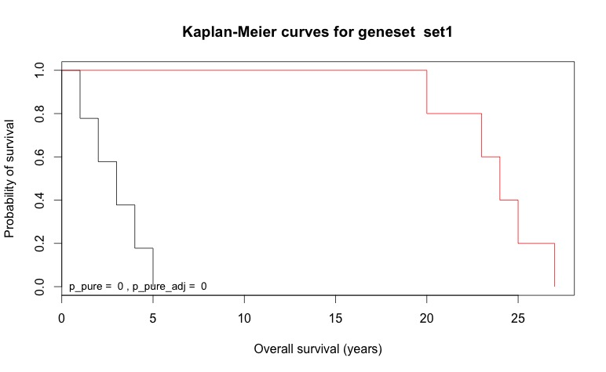
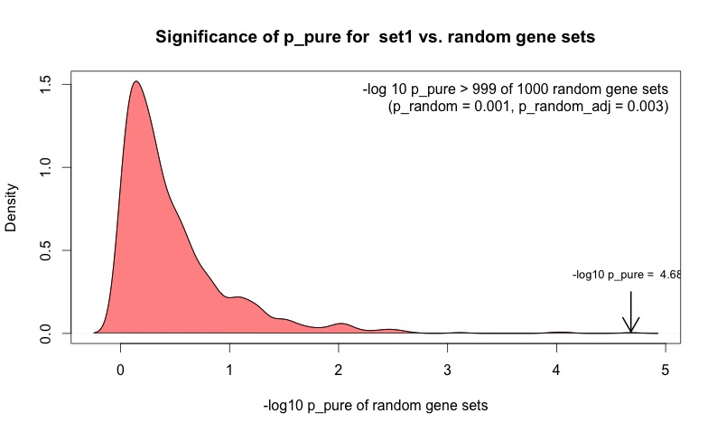
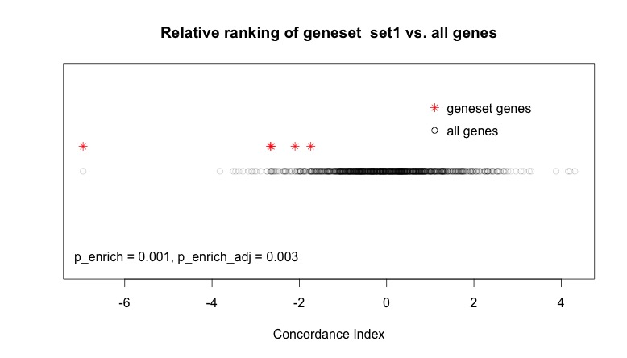
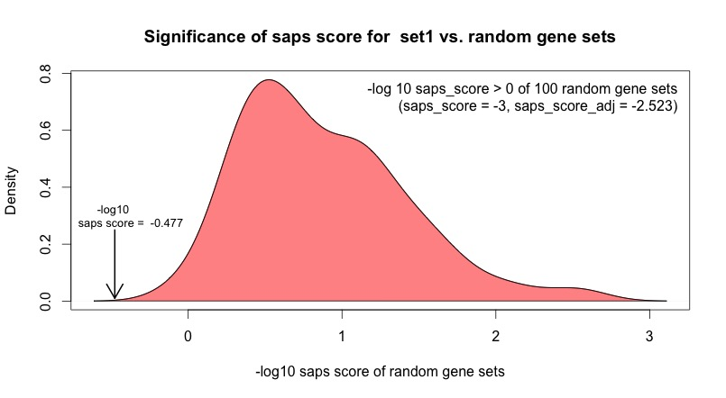

---
# Welcome

Welcome to the **saps** package! This vignette will explain the functionality of the package via the hands-on creation of a sample dataset. For an in-depth explanation of the saps algorithm itself, the original publication should be consulted.

The package is usually accessed via a single function called `saps`. This function requires, at a minimum, four things:

* Some candidate genesets (at least one)
* Expression data for a set of genes
* Patient survival times
* An indication of whether each patient was lost to followup

We'll create each of these items. 

First, let's load the saps package:

```{r, message=FALSE, eval=FALSE}
library(saps)
```


# Creating a dataset

Let's suppose we have 50 patients in our study, and each patient was followed until they died from disease (i.e. nobody was lost to followup). In this case the "followup" vector is simply a series of 50 1s:


```{r, eval=FALSE}
followup <- rep(1, 50)
```
Let's further suppose that five patients in the study had markedly superior survival times compared to the remainder of the patients. We'll express survival times in days, which is the convention:

```{r, eval=FALSE}
time <- c(20, 23, 25, 24, 27, sample(1:5, 45, TRUE))
time <- time*365
```
The first five patients all survived 20+ years, while the remainder only survived 1-5 years.

We'll next create a dataset of gene expression data for 1000 genes, which we'll label "1" through "1000". We'll need a row of data for each patient, and each column will hold data for a single gene:

```{r, eval=FALSE}
dat <- matrix(rnorm(50*1000), nrow=50, ncol=1000)
colnames(dat) <- as.character(1:1000)
```
Next we'll create a few genesets. A geneset is simply a vector of gene labels. We'll create a few genesets containing five genes each, one with a set of genes of our choosing, and two with randomly selected genes. 

```{r, eval=FALSE}
set1 <- c("10", "41", "11", "42", "50")
set2 <- sample(colnames(dat), 5)
set3 <- sample(colnames(dat), 5)
```
Next we'll use `rbind` to concatenate the three genesets.
```{r, eval=FALSE}
genesets <- rbind(set1, set2, set3)
```

# Computing saps statistics
We're now ready to proceed with a basic saps analysis.
```{r, eval=FALSE}
results <- saps(genesets, dat, time, followup)
```
We're not expecting any significant results with these genesets, since the data is normally distributed and the genesets were randomly generated. To get a quick look at the saps statistics, we can access the `saps_table` dataframe. We'll examine the statistics unadjusted for multiple comparisons first.
```{r, eval=FALSE}
saps_table <- results$saps_table
saps_table[1:7]
```
```
     size    p_pure p_random p_enrich direction  saps_score saps_qvalue
set1    5 0.5334222    0.561  0.26240        -1 -0.25103714          NA
set2    5 0.7471838    0.750  0.13721        -1 -0.12493874          NA
set3    5 0.8055783    0.836  0.45363         1  0.07779372          NA
```

As expected, none of the three basic saps statistics (p_pure, p_random, p_enrich) achieve significance, and consequently the saps score is also not significant. We haven't asked for a saps q-value, so the corresponding field is set to NA. The data adjusted for multiple comparisons will only decrease the significance, so there's no point in examining the adjusted values.

# Achieving significance
We know the first five patients in our study survived much longer, but this fact is currently not reflected in any differences in gene expression levels amongst those patients. We'll artifically tweak the data for these five patients. We'll specifically alter the expression values for the genes in `set1`.
```{r, eval=FALSE}
dat2 <- dat
dat2[1:5, set1] <- dat2[1:5, set1]+10
```
Now the patients surviving longer have much higher expression levels of the genes in `set1`. Let's see what effect this has on the computed saps statistics.
```{r, eval=FALSE}
results <- saps(genesets, dat2, time, followup)
```
```{r, eval=FALSE}
saps_table <- results$saps_table
saps_table[1:7]
```
```
     size       p_pure p_random    p_enrich direction saps_score saps_qvalue
set1    5 2.079748e-05    0.001 0.000999001        -1 -3.0000000          NA
set2    5 7.623650e-01    0.777 0.143690000        -1 -0.1095790          NA
set3    5 3.850677e-01    0.426 0.469850000         1  0.3280408          NA
```
We see that all three saps statistics have achieved significance, and consequently the saps score is significant as well (absolute value greater than 1.3). We should examine the multiple comparison adjusted values to make sure the significance still holds.
```{r, eval=FALSE}
saps_table[8:11]
```
```
       p_pure_adj p_random_adj p_enrich_adj saps_score_adj
set1 6.239244e-05        0.003  0.002997003     -2.5228787
set2 7.623650e-01        0.777  0.215535000     -0.1095790
set3 5.776016e-01        0.639  0.469850000      0.1944991
```
The values are still significant.

# Visualization
To get a visual sense of the signifiance of p_pure, let's look at a Kaplan-Meier survival curve for geneset `set1` using the `plotKM` function. We'll convert our survival times back to years first.

```{r, eval=FALSE}
set1 <- results$genesets[["set1"]]

plotKM(set1, time/365, followup, x.label="Overall survival (years)")
```


We've artifically linked higher expression of `set1` genes to better survival, and the k-means clustering performed to calculate p_pure can thus readily cluster patients into two survival groups based on differential expression of these genes.

Let's also have a look at the distribution of p_pure values for randomly generated genesets, and see how the p_pure for `set1` compares.
```{r, eval=FALSE}
plotRandomDensity(set1)
```



Not unexpectedly, almost no randomly selected genesets achieved a p_pure as significant as `set1` (although notably, one did, completely by chance!).

Finally, let's visualize the concordance indices for the genes in `set1` versus those of all the genes in the dataset.
```{r, eval=FALSE}
plotEnrichment(set1, results$rankedGenes)
```


The concordance indices for `set1` are clustered towards one extreme of the distribution of all concordance indices, which explains the significant p_enrich.

# Computing saps q-values
We haven't yet computed q-values, so let's do that. This is a computationally expensive procedure, since saps scores (and thus all the saps statistics) need to be computed for a large number of randomly generated genesets (1000 by default). In many applications, this final step may not be necessary, but it does add an additional layer of robustness to the method. 

If your computer supports multiple cpus or cores, it is highly recommended that you call `saps` with `cpus` set to the maximum allowable (often this will be 4). One can also adjust the `qvalue.samples` value to a lower number. Caution should be excercised if this is done, because in the event that no random genesets achieve saps scores as significant as the candidate set, the q-value returned is not 0 but `1/(qvalue.samples+1)`. Thus, choosing a low value for `qvalue.samples` may result in non-significant q-values.

Nevertheless, for the purposes of this vignette we will only compute saps scores for 100 random genesets in order to calculate the q-value. We'll also set `cpus=4`.

```{r, eval=FALSE}
results <- saps(genesets, dat2, time, followup, cpus=4, 
                compute_qvalue=TRUE, qvalue.samples=100)
```
```{r, eval=FALSE}
saps_table <- results$saps_table

saps_table[, c("saps_qvalue", "saps_qvalue_adj")]
```
```
     saps_qvalue saps_qvalue_adj
set1  0.00990099      0.02970297
set2  0.69000000      0.69000000
set3  0.20000000      0.30000000
```

The q-value is significant, even when adjusted for multiple comparisons, but not by a large margin. It appears the q-value has been computed as 1/101, implying that no random genesets achieved a saps score at least as significant as the saps score for `set1`. We can use the function `plotSapsScoreDensity` to visualize the distribution of random saps scores.

```{r, eval=FALSE}
set1 <- results$genesets[["set1"]]

plotSapsScoreDensity(set1)
```



Indeed, none of the 100 random genesets achieved a -log10 saps score at least as small as that for `set1`, so the q-value is computed as 1/101. If more genesets are analyzed, this value may not achieve significance when adjusted, so in practice choosing a larger value for `qvalue.samples` is highly recommended (the default of 1000 is reasonable.)

# Wrapping up
This completes the vignette. All the core functionality of the package has been utilized, albeit in a highly artificial context. For details of the various functions, and for an overview of the saps method, please read the documentation. For a complete explanation of the method, the original publication by Beck et. al. should be consulted.

